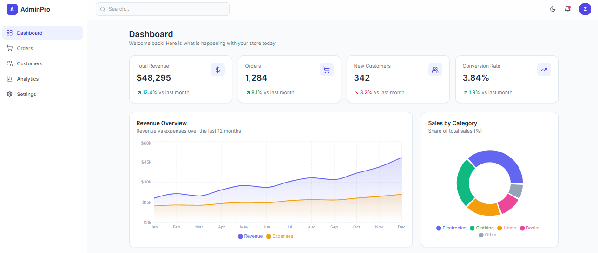

# Admin Dashboard

A clean, responsive admin dashboard built with **React**, **Tailwind CSS**, **Vite** and **Recharts**.

🔗 **Live demo:** https://YOUR-USERNAME.github.io/admin-dashboard/

 screenshot: 

## Features

- Responsive layout with collapsible sidebar (mobile friendly)
- Dark / light mode toggle (defaults to system preference)
- KPI stat cards with month-over-month change
- Revenue area chart, weekly traffic bar chart and sales-by-category donut chart
- Recent orders table with status badges
- Mock data kept separate in `src/data/mock.js` so it is easy to swap for a real API

## Tech stack

- [React 18](https://react.dev/)
- [Vite](https://vitejs.dev/)
- [Tailwind CSS 3](https://tailwindcss.com/)
- [Recharts](https://recharts.org/)
- [lucide-react](https://lucide.dev/) icons

## Getting started

```bash
npm install
npm run dev
```

Then open http://localhost:5173.

Build for production:

```bash
npm run build
npm run preview
```

## Project structure

```
src/
├── components/
│   ├── Sidebar.jsx
│   ├── Header.jsx
│   ├── StatCard.jsx
│   ├── RevenueChart.jsx
│   ├── TrafficChart.jsx
│   ├── CategoryChart.jsx
│   └── OrdersTable.jsx
├── data/
│   └── mock.js
├── App.jsx
├── main.jsx
└── index.css
```

## Author

Zahra Haghjo · [LinkedIn](https://www.linkedin.com/in/zahrahaghjo) · [GitHub](https://github.com/zahrahaghjo)
# admin-dashboard
